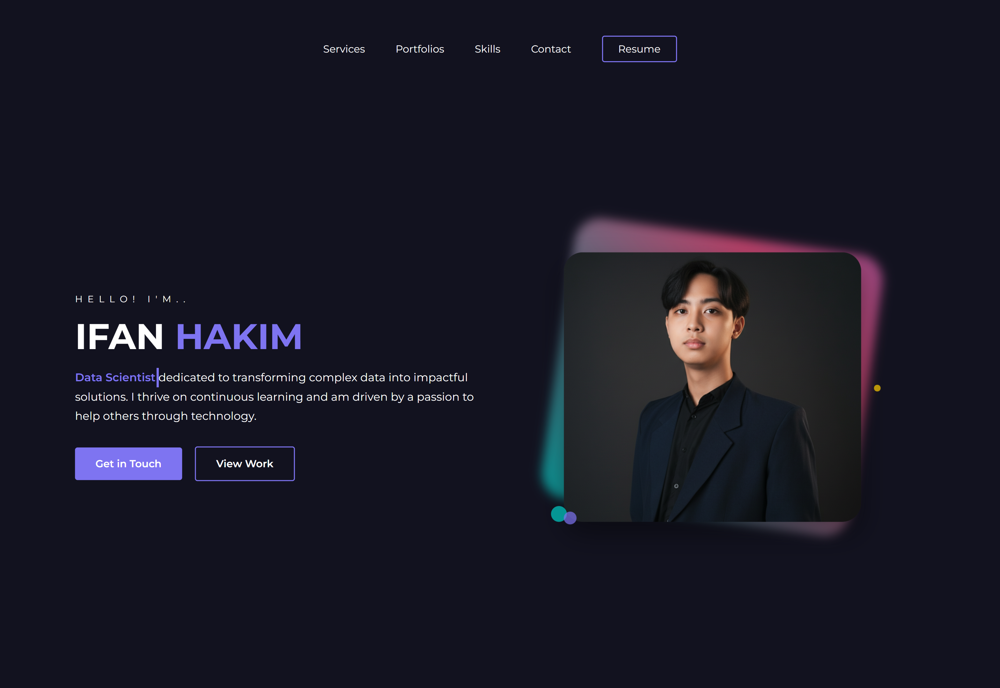

# Personal Portfolio Website - Ifan Hakim

A modern, responsive personal portfolio website showcasing expertise in Artificial Intelligence, Data Science, Computer Vision, and Generative AI. Built with clean HTML, CSS, and JavaScript, featuring interactive animations and a professional design to highlight projects and skills.

[](https://portfolio-ifanhakim.netlify.app/)
*<p align="center">Click the image to view the live demo</p>*

## 🚀 Live Demo

The live version of this portfolio can be accessed here: **[https://portfolio-ifanhakim.netlify.app/](https://portfolio-ifanhakim.netlify.app/)**

## ✨ Features

-   **Fully Responsive Design:** Seamlessly adapts to all device sizes, ensuring an optimal viewing experience on mobile, tablet, and desktop.
-   **Interactive Background:** Dynamic animated background with stars and particle effects powered by `particles.js` for an engaging visual experience.
-   **Dynamic Typing Effect:** Animated text in the hero section that cycles through key skills and interests.
-   **Dynamic Project Filtering:** Portfolio section with category-based filtering (Data Science/ML, Computer Vision, NLP, Generative AI, Software/Web, Business) for easy navigation.
-   **Load More Functionality:** Displays initial projects with an option to load additional ones dynamically.
-   **Smooth Scroll & Animations:** Elements animate into view on scroll, enhancing user interaction and flow.
-   **Functional Contact Form:** Integrated contact form using Formspree for direct inquiries.
-   **Professional Sections:** Dedicated areas for services, featured portfolios, education, skills, and contact information.

## 💻 Technologies Used

This project leverages modern web technologies for a lightweight, fast, and maintainable website.

-   **Frontend:**
    -   HTML5
    -   CSS3 (Custom styling with responsive design)
    -   JavaScript (ES6+ for interactivity)

-   **Libraries & Frameworks:**
    -   **Particles.js:** Creates interactive particle animations in the background.
    -   **Font Awesome:** Provides scalable vector icons for UI elements.

-   **Deployment:**
    -   **Netlify:** For seamless deployment and hosting.

## 🛠️ Setup and Local Installation

To run this project locally, follow these steps:

1.  **Clone the repository:**
    ```bash
    git clone https://github.com/ifanhakm/portfolio-website.git
    ```

2.  **Navigate to the project directory:**
    ```bash
    cd portfolio
    ```

3.  **Open the `index.html` file in your browser:**
    -   Double-click `index.html` to open directly.
    -   For development, use a live server (e.g., VS Code's Live Server extension) to enable auto-reload on changes.

No additional dependencies or build steps are required, as this is a static website.

## 📁 Project Structure

```
portfolio/
├── index.html               # Main HTML file
├── styling-portofolio.css   # Main stylesheet
├── responsive.css           # Responsive design styles
├── portfolio-script.js      # JavaScript for interactivity
├── vercel.json              # Vercel deployment configuration
├── assets/                  # Icons and assets
├── img/                     # Images, resume, and project screenshots
└── README.md                # Project documentation
```

## 📫 Contact

I'm always open to collaborations, opportunities, and discussions in AI and technology. Feel free to reach out:

-   **LinkedIn:** [Ifan Hakim](https://www.linkedin.com/in/ifanhakim)
-   **Email:** [ifanhakm@gmail.com](mailto:ifanhakm@gmail.com)
-   **GitHub:** [ifanhakm](https://github.com/ifanhakm)
-   **Instagram:** [@_ifqnhakm](https://www.instagram.com/_ifqnhakm)

## 📄 License

This project is open source and available under the [MIT License](LICENSE).
